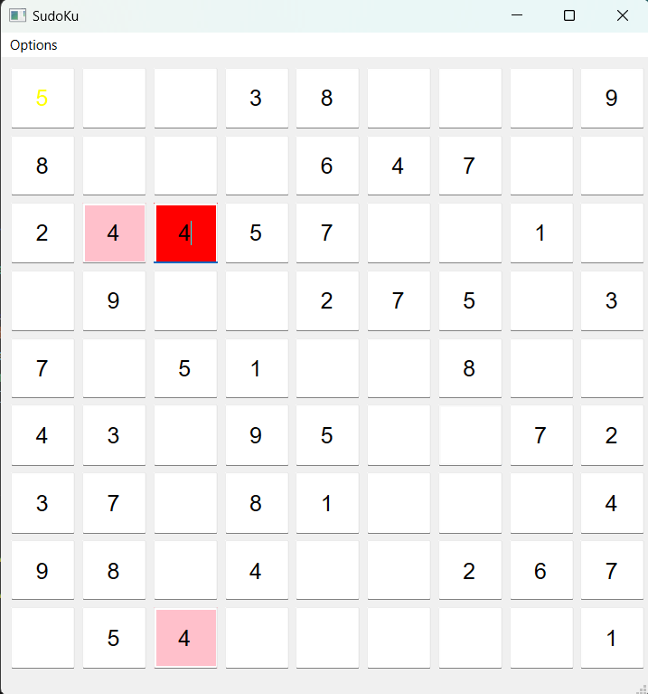
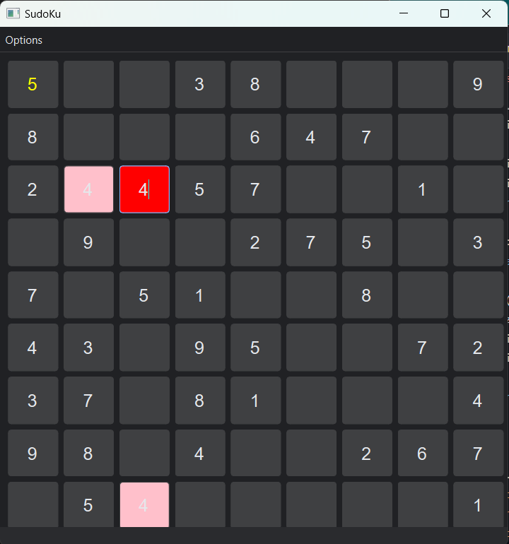
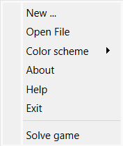

# SudoKu
**Design by QtPy.**

Sudoku is a logic-based, combinatorial number-placement puzzle. In classic Sudoku, the objective is to fill a 9 * 9 grid with digits so that each column, each row, and each of the nine 3 * 3 subgrades that compose the grid (also called 'boxes', 'blocks', or 'regions') contain all of the digits from 1 to 9. The puzzle setter provides a partially completed grid, which for a well-posed puzzle has a single solution.\n\nFrench newspapers featured variations of the Sudoku puzzles in the 19th century, and the puzzle has appeared since 1979 in puzzle books under the name Number Place. However, the modern Sudoku only began to gain widespread popularity in 1986 when it was published by the Japanese puzzle company Nikoli under the name Sudoku, meaning 'single number'.It first appeared in a U.S. newspaper, and then The Times (London), in 2004, thanks to the efforts of Wayne Gould, who devised a computer program to rapidly produce unique puzzles.

I use [py-sudoku](https://github.com/jeffsieu/py-sudoku) library to make sudoku numbers. In this app user can set difficulty for new game or open file game.
## GUI
Light theme:

Dark theme:
 

I used [PyQtDarkTheme](https://github.com/5yutan5/PyQtDarkTheme) library to dark them.

## Options

New: you can start a new game.

Open file: you can play your sudoku by opening the txt file.

Color scheme: you can switch theme between dark and light.

About: explain about SudoKu.

Help: explain about SudoKu's rules.

Exit: close game.

Solve game: solve the puzzle.
